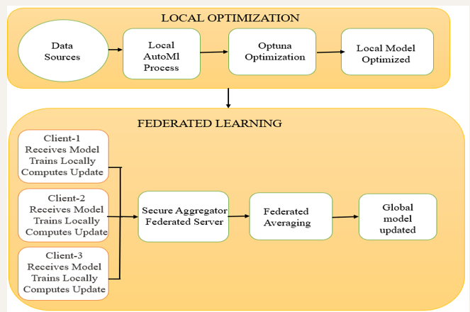

# Neurodivergent Disease Prediction using Federated Learning, AutoML, and Optuna

## Overview

Neurodivergent conditions such as **Autism Spectrum Disorder (ASD), Parkinson’s Disease, and Amyotrophic Lateral Sclerosis (ALS)** involve complex clinical and behavioral patterns. Early detection and continuous monitoring are essential for timely intervention, but healthcare datasets are often distributed across hospitals and research institutions, making centralized training difficult due to **privacy concerns and regulatory restrictions**.

This project presents a **privacy-preserving AI framework** that combines **Federated Learning, AutoML, and Optuna-based hyperparameter optimization** to build highly accurate predictive models using distributed tabular healthcare datasets.

The system enables collaborative model training across multiple institutions **without sharing raw patient data**, ensuring data privacy while improving model generalization across heterogeneous medical datasets.

---

# Key Features

* **Privacy-Preserving Federated Learning**

  * Trains models across multiple institutions without exposing raw patient data.
  * Uses **Federated Averaging (FedAvg)** for secure global model aggregation.

* **Automated Machine Learning (AutoML)**

  * Automatically explores:

    * Random Forest
    * XGBoost
    * LightGBM
    * Neural Networks
    * Data preprocessing pipelines

* **Hyperparameter Optimization with Optuna**

  * Automatically fine-tunes model parameters for maximum predictive performance.

* **Multi-Disease Prediction**
  Supports:

  * Autism Spectrum Disorder (ASD)
  * Parkinson’s Disease
  * Amyotrophic Lateral Sclerosis (ALS)

* **Scalable Client-Server Architecture**

  * **3 Distributed Clients** (datasets)
  * **1 Central Aggregation Server**

---

# Architecture

```plaintext
        Client 1 (Autism Dataset)
              |
        Client 2 (Parkinson Dataset)
              |
        Client 3 (ALS Dataset)
              |
     -------------------------
     Federated Averaging Server
     -------------------------
              |
       Global Optimized Model
```

Each client:

* Loads local CSV healthcare dataset
* Runs local AutoML model search
* Uses Optuna for tuning
* Trains locally
* Sends model updates to central server

The server:

* Aggregates updates using **FedAvg**
* Updates global model
* Redistributes improved model to all clients

---

# Dataset Description

The project uses structured CSV datasets containing:

### Patient Demographics

* Age
* Gender
* Family medical history

### Clinical Assessments

* Cognitive evaluation scores
* Motor function scores
* Behavioral test results

### Neurological Tests

* Clinical biomarkers
* Diagnostic indicators

### Behavioral Scores

* Autism screening responses
* Parkinson progression metrics
* ALS symptom severity scores

---

# Technologies Used

* **Python**
* **Scikit-learn**
* **XGBoost**
* **LightGBM**
* **TensorFlow / PyTorch**
* **Optuna**
* **FLWR (Flower Federated Learning)**
* **Pandas**
* **NumPy**

---

# Workflow

## Step 1: Data Loading

Distributed CSV datasets are loaded locally on each client.

## Step 2: Data Preprocessing

* Missing value handling
* Feature normalization
* Encoding categorical features

## Step 3: AutoML Search

Automatically selects the best model architecture.

## Step 4: Optuna Optimization

Optimizes:

* Learning rate
* Tree depth
* Number of estimators
* Batch size
* Regularization parameters
  

Hyperparameter Interaction Visualization
This contour plot visualizes:


Parameter interactions
Optimization convergence regions
Best-performing hyperparameter zones
## Step 5: Local Training

Each client trains its optimized model independently.

## Step 6: Federated Aggregation

Global model updates are combined using **FedAvg**.

## Step 7: Evaluation

Performance metrics:

* Accuracy
* Precision
* Recall
* F1-score
* ROC-AUC

---

# Advantages

### Privacy Preservation

Sensitive healthcare data never leaves local institutions.

### Reduced Manual Effort

AutoML + Optuna automate model selection and tuning.

### Better Generalization

Learns from distributed heterogeneous datasets.

### Scalability

Supports multiple disorders and institutions simultaneously.

### Regulatory Compliance

Suitable for privacy-sensitive healthcare environments.

---

# Results

The framework demonstrates:

* High predictive accuracy
* Strong generalization across datasets
* Robust privacy-preserving learning
* Efficient automated optimization

It enables **early diagnosis, severity assessment, and progression prediction** for neurodivergent disorders.

---

# Project Outcome

This project demonstrates a **state-of-the-art AI framework for tabular healthcare prediction**, integrating:

* Federated Learning
* AutoML
* Hyperparameter Optimization
* Privacy Preservation
* Distributed Healthcare Intelligence

The system supports **next-generation predictive healthcare analytics** for neurodivergent disease detection and monitoring.

---

# Future Scope

* Differential Privacy integration
* Secure aggregation protocols
* Explainable AI (XAI) for medical interpretability
* Real-time hospital deployment
* Expansion to additional neurological disorders

---

# Author

**Laxmipriya Rout**
B.Tech CSE (3rd Year)
Centurion University of Technology and Management
Research Focus: **AI, Federated Learning, Healthcare AI, Edge AI, Deep Learning**
